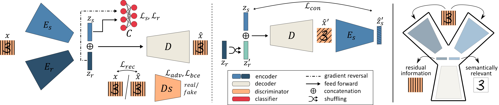

# Y-GAN
Official implementation of the paper "Y-GAN: Learning Dual Data Representations for Efficient Anomaly Detection" [^1]. 
Y-GAN is a one-class learning model designed for the detection of anomalies in images. The model is trained to disentangle semantically-relevant image information from irrelevant, residual characteristics and facilitates efficacious anomaly detection based on selective image encoding. 

      



For more information please refer to the paper available [here](https://arxiv.org/abs/2109.14020).

## 1. Install the dependencies
The model is implemented using PyTorch. The full list of used libraries can be found in requirements.txt.
```
pip install -r requirements.txt
```

## 2. Prepare the data
The dataset you are using for training or testing Y-GAN should have the following directory structure where the names of individual classes are represented with unique numbers or strings:
```
Dataset_name
├── test
│   ├── 0.normal
│   │   ├── 0
│   │   │   └── normal_train_class_0_img_0.png
│   │   │   └── normal_train_class_0_img_1.png
│   │   │   ...
|   │   ...
│   │   ├── n
│   │   │   └── normal_train_class_n_img_0.png
│   │   │   └── normal_train_class_n_img_1.png
│   │   │   ...
│   ├── 1.abnormal
│   │   ├── m
│   │   │   └── abnormal_test_class_m_img_0.png
│   │   │   └── abnormal_test_class_m_img_1.png
│   │   │   ...
├── train
│   ├── 0.normal
│   │   ├── 0
│   │   │   └── normal_test_class_0_img_0.png
│   │   │   └── normal_test_class_0_img_1.png
│   │   │   ...
|   │   ...
```

## 3. Training
To train Y-GAN on Dataset_name placed in a root directory named data, run the following:
```
python train.py --dataroot data --dataset Dataset_name --name experiment_name --isize image_size
```
## 4. Evaluation
To test a pretrained Y-GAN run the following:
```
python test.py --dataroot data --dataset Dataset_name --name experiment_name --isize image_size --load_checkpoint output/experiment_name/train/weights/y_gan.pth
```
## 5. Citing Y-GAN
If you find this code useful or you want to refer to the paper, please cite using the following BibTeX:
```
@article{ivanovska2024ygan,
      title={Y-GAN: Learning Dual Data Representations for Efficient Anomaly Detection}, 
      author={Marija Ivanovska and Vitomir Štruc},
      journal = {Expert Systems with Applications},
      volume = {248},
      pages = {123410},
      year = {2024},
      issn = {0957-4174},
      doi = {https://doi.org/10.1016/j.eswa.2024.123410}
      }
```

## Acknowledgements
This code is partly based on the official implementation of [skip-GANomaly](https://github.com/samet-akcay/skip-ganomaly).

## References
[^1]: M. Ivanovska, V. Struc, Y-GAN: Learning Dual Data Representations for Efficient Anomaly Detection, Expert Systems with Applications, 2024
